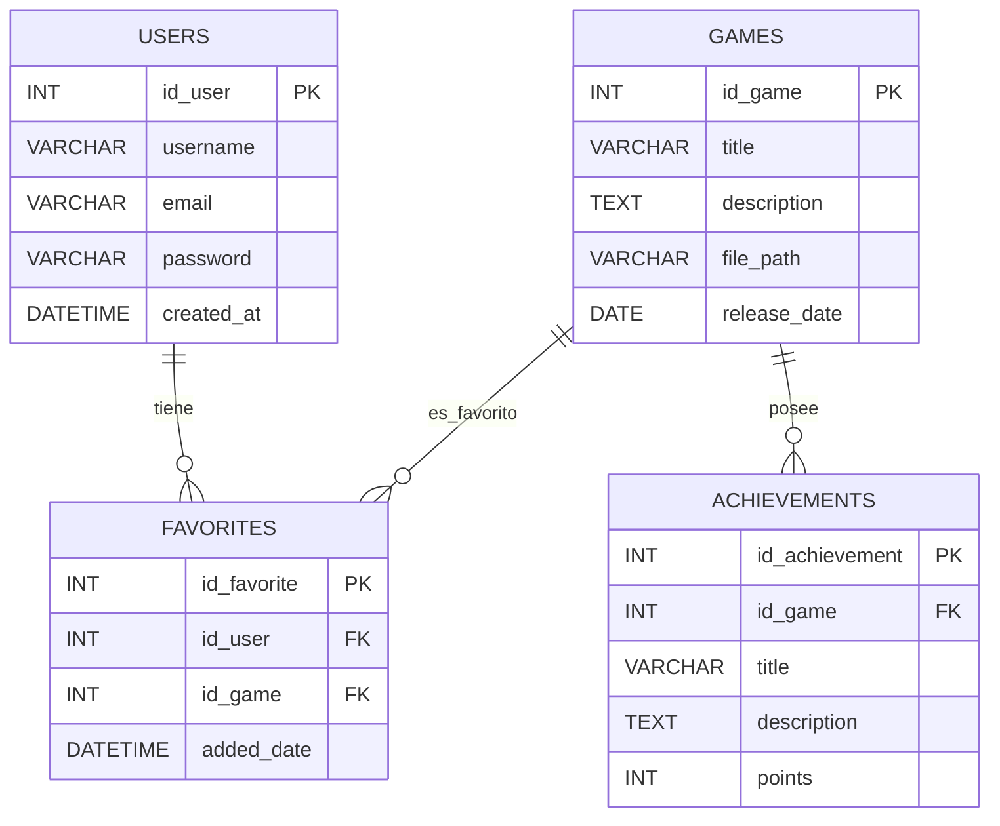

## Diagrama Entidad-Relación (ER)

```mermaid
erDiagram

    USERS {
        INT id_user PK
        VARCHAR username
        VARCHAR email
        VARCHAR password
        DATETIME created_at
    }

    GAMES {
        INT id_game PK
        VARCHAR title
        TEXT description
        VARCHAR file_path
        DATE release_date
    }

    FAVORITES {
        INT id_favorite PK
        INT id_user FK
        INT id_game FK
        DATETIME added_date
    }

    ACHIEVEMENTS {
        INT id_achievement PK
        INT id_game FK
        VARCHAR title
        TEXT description
        INT points
    }

    USERS ||--o{ FAVORITES : tiene
    GAMES ||--o{ FAVORITES : es_favorito
    GAMES ||--o{ ACHIEVEMENTS : posee
```
