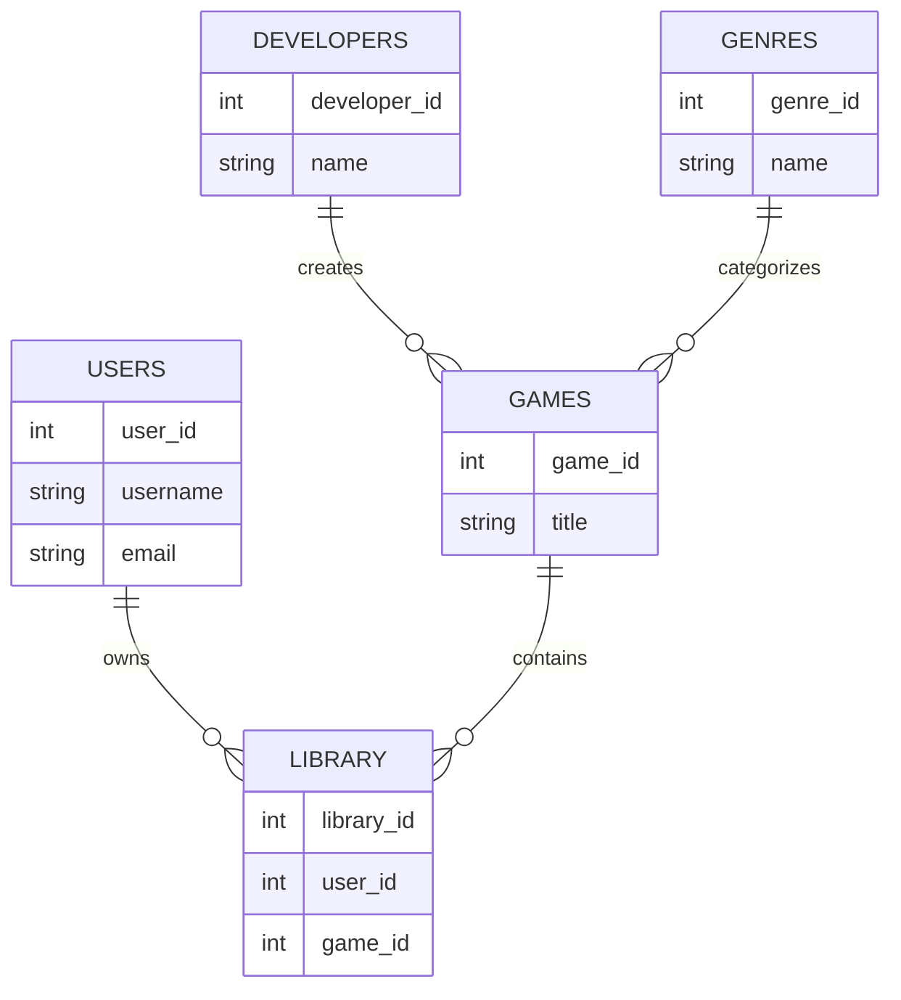

# ER Diagram

```mermaid
erDiagram

USERS ||--o{ LIBRARY : owns
GAMES ||--o{ LIBRARY : contains
DEVELOPERS ||--o{ GAMES : creates
GENRES ||--o{ GAMES : categorizes

USERS {
int user_id
string username
string email
}

GAMES {
int game_id
string title
}

DEVELOPERS {
int developer_id
string name
}

GENRES {
int genre_id
string name
}

LIBRARY {
int library_id
int user_id
int game_id
}
```

