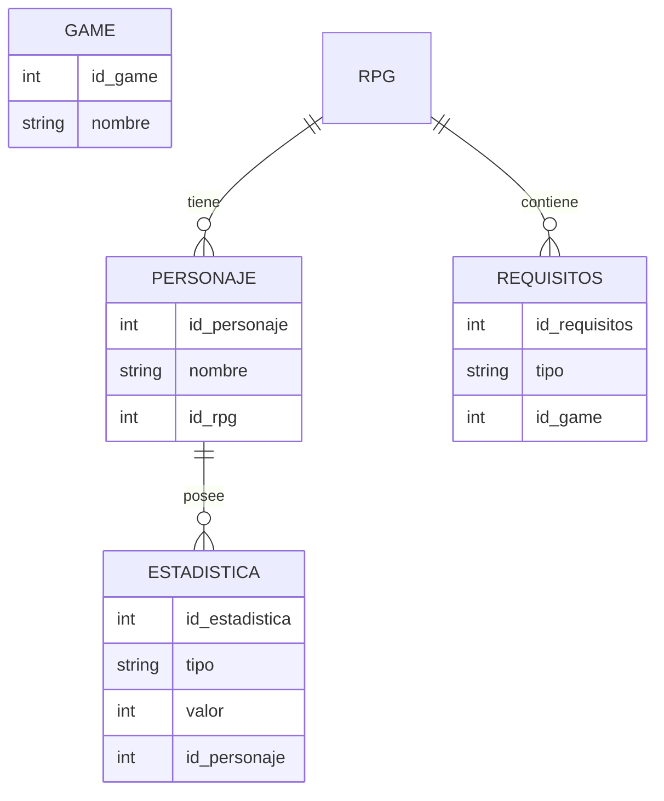

erDiagram

## Diagrama E-R

```mermaid

  erDiagram

    GAME {
        int id_game
        string nombre
    }

    PERSONAJE {
        int id_personaje
        string nombre
        int id_rpg
    }

    ESTADISTICA {
        int id_estadistica
        string tipo
        int valor
        int id_personaje
    }

    REQUISITOS {
        int id_requisitos
        string tipo
        int id_game
    }

    RPG ||--o{ PERSONAJE : tiene
    RPG ||--o{ REQUISITOS : contiene
    PERSONAJE ||--o{ ESTADISTICA : posee
```
