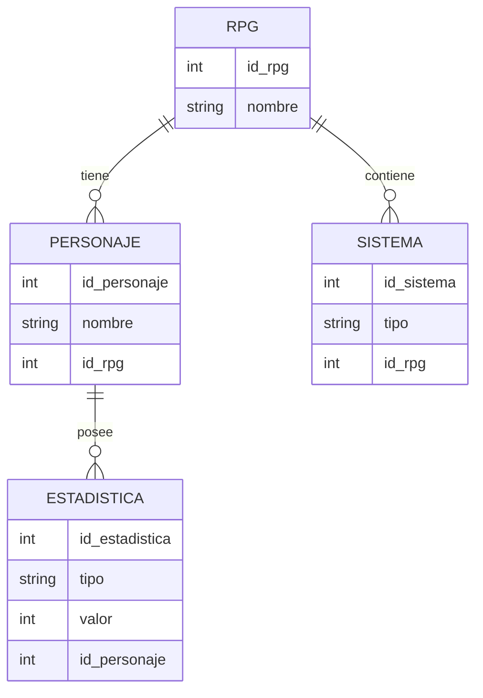

erDiagram

## Diagrama E-R

```mermaid

  erDiagram

    RPG {
        int id_rpg
        string nombre
    }

    PERSONAJE {
        int id_personaje
        string nombre
        int id_rpg
    }

    ESTADISTICA {
        int id_estadistica
        string tipo
        int valor
        int id_personaje
    }

    SISTEMA {
        int id_sistema
        string tipo
        int id_rpg
    }

    RPG ||--o{ PERSONAJE : tiene
    RPG ||--o{ SISTEMA : contiene
    PERSONAJE ||--o{ ESTADISTICA : posee
```
