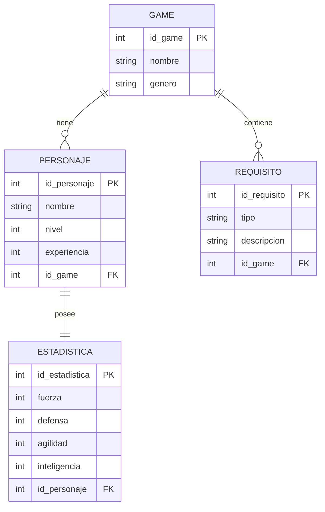

```mermaid
erDiagram

    GAME {
        int id_game PK
        string nombre
        string genero
    }

    PERSONAJE {
        int id_personaje PK
        string nombre
        int nivel
        int experiencia
        int id_game FK
    }

    ESTADISTICA {
        int id_estadistica PK
        int fuerza
        int defensa
        int agilidad
        int inteligencia
        int id_personaje FK
    }

    REQUISITO {
        int id_requisito PK
        string tipo
        string descripcion
        int id_game FK
    }

    GAME ||--o{ PERSONAJE : tiene
    GAME ||--o{ REQUISITO : contiene
    PERSONAJE ||--|| ESTADISTICA : posee
```
